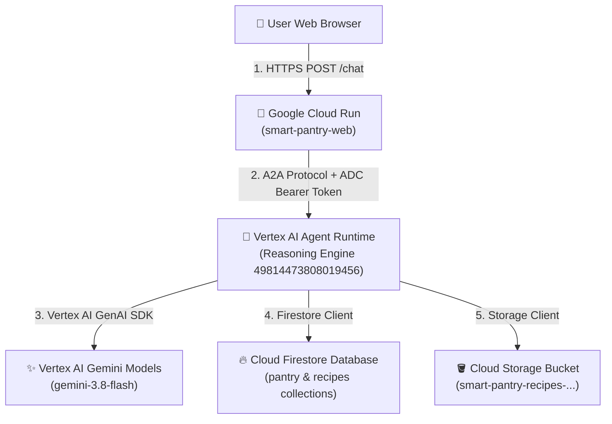

# 📘 Smart Pantry & Recipe Concierge: Architecture & GCP Connectivity Guide

## 1. System Overview

The **Smart Pantry & Recipe Concierge** is an autonomous AI agent application built on the **Google Agent Development Kit (ADK)** and deployed to **Google Cloud Platform (GCP)**. 

The architecture separates the frontend web proxy from the AI reasoning engine to ensure secure, credential-free browser interaction.

---

## 2. Architecture & Data Flow Diagram



---

## 3. How the Remote Machine Connects to GCP

This development environment (remote machine) communicates with GCP via the following configuration:

1. **Service Account Identity**:
   - Authenticated as `antigravity-sa@qwiklabs-gcp-02-02945075a7b2.iam.gserviceaccount.com`.
   - Authorized with IAM permissions (`Owner` / `Editor` / `Vertex AI User`) for project `qwiklabs-gcp-02-02945075a7b2`.

2. **Environment Variables**:
   - `GOOGLE_CLOUD_PROJECT=qwiklabs-gcp-02-02945075a7b2`: Sets the active target project ID.
   - `GOOGLE_GENAI_USE_VERTEXAI=true`: Enables Vertex AI authentication via Application Default Credentials (ADC).

3. **CLIs & Tooling**:
   - `gcloud`: Deploys Cloud Run services and configures GCS buckets/IAM.
   - `agents-cli`: Deploys ADK agents to Vertex AI Agent Runtime.

---

## 4. Deployed GCP Resources

| Resource | Service Type | Location / URI |
| :--- | :--- | :--- |
| **Web Proxy App** | Google Cloud Run | [smart-pantry-web](https://smart-pantry-web-151186006717.us-east1.run.app) |
| **Reasoning Engine** | Vertex AI Agent Runtime | `projects/151186006717/locations/us-east1/reasoningEngines/49814473808019456` |
| **Media Bucket** | Cloud Storage | `gs://smart-pantry-recipes-qwiklabs-gcp-02-02945075a7b2` |
| **NoSQL Database** | Cloud Firestore | `qwiklabs-gcp-02-02945075a7b2` (Native Mode) |

---

## 5. End-to-End Interaction Lifecycle

1. **User Request**: The user submits a prompt in their web browser at [https://smart-pantry-web-151186006717.us-east1.run.app](https://smart-pantry-web-151186006717.us-east1.run.app).
2. **Proxy Forwarding**: Cloud Run (`main.py`) receives the request, attaches a Google Cloud OAuth2 token (`Authorization: Bearer <token>`), and sends an A2A message to Vertex AI Agent Runtime.
3. **Agent Execution**: The Reasoning Engine runs `simple_agent`, invoking tools to check Firestore pantry items or query recipes.
4. **Media Generation**: If dish photos/videos are generated, they are saved to the GCS bucket (`smart-pantry-recipes-...`).
5. **UI Rendering**: The agent streams back structured A2UI cards to the browser for interactive rendering.

---

## 6. Bucket Security Commands Reference

- **Grant Public Read Access** (allows direct browser links):
  ```bash
  gcloud storage buckets add-iam-policy-binding gs://smart-pantry-recipes-qwiklabs-gcp-02-02945075a7b2 \
    --member=allUsers \
    --role=roles/storage.objectViewer
  ```

- **Restrict Public Access** (makes bucket private):
  ```bash
  gcloud storage buckets update gs://smart-pantry-recipes-qwiklabs-gcp-02-02945075a7b2 \
    --public-access-prevention
  ```
