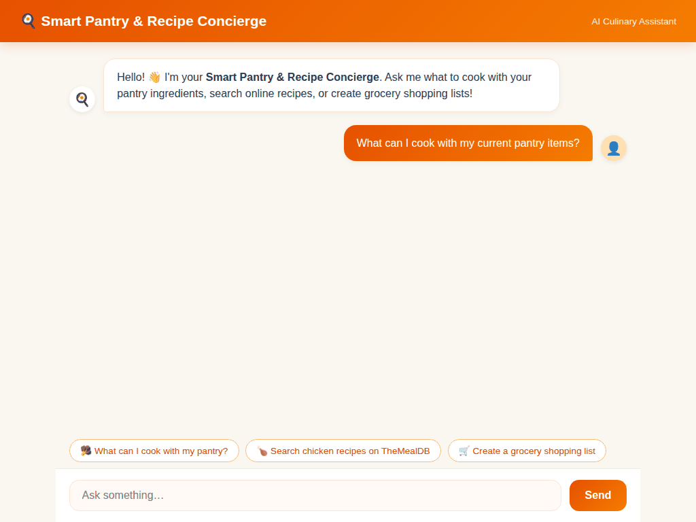

# 🍳 Smart Pantry & Recipe Concierge

An AI culinary concierge agent built with **Google Agent Development Kit (ADK)**, **Gemini 2.5 Flash**, **TheMealDB API**, and **Vertex AI Multimodal Models**. It manages real-time pantry inventory, suggests recipes based on available ingredients, generates AI food photography and cooking videos, and outputs dynamic A2UI rich cards.

---

## 📽️ Demo Walkthrough



---

## 🛠️ Google Cloud Services & Integrations

The agent connects directly to the following Google Cloud services and APIs:

- **Google Cloud Firestore**: Persistent database storage for pantry inventory (`pantry_inventory`) and user saved recipes (`saved_recipes`).
- **Vertex AI Memory Bank (`VertexAiMemoryBankService`)**: Cross-session conversational memory bank persistence.
- **Google Cloud Storage (GCS)**: Stores and serves generated food photography and short cooking videos from a public GCS bucket.
- **Vertex AI Gemini Models**:
  - `gemini-2.5-flash`: Primary agent reasoning and tool call execution model.
  - `gemini-3.1-flash-lite-image`: Generates gourmet food photography for dishes and ingredients.
  - `gemini-omni-flash-preview`: Generates short culinary cooking and plating videos via the Vertex AI Interactions API.
- **TheMealDB REST API**: External recipe lookup service for global meal searches.
- **A2UI (Agent-to-User Interface) Catalog 0.8**: Renders rich interactive card components in the chat interface.

---

## 🔧 Implemented Agent Tools

The agent exposes the following 13 tools registered in `app/agent.py`:

| Tool Name | Function & Integration |
| :--- | :--- |
| `get_pantry_inventory` | Queries Firestore for all current items in the user's pantry. |
| `add_pantry_item` | Inserts new items into the Firestore pantry inventory collection. |
| `remove_pantry_item` | Deletes specified items from the Firestore pantry inventory. |
| `search_recipes_by_ingredients` | Filters recipes in Firestore that match given ingredient inputs. |
| `get_all_recipes` | Retrieves all available recipes stored in Firestore. |
| `save_favorite_recipe` | Saves custom or online recipes to user favorites in Firestore. |
| `delete_recipe` | Removes a recipe entry from Firestore. |
| `scale_recipe_servings` | Recalculates ingredient quantities and nutritional macros for target serving sizes. |
| `get_recipe_card_ui` | Constructs structured A2UI card schemas for visual recipe presentation. |
| `export_grocery_shopping_list` | Generates a formatted grocery shopping list for missing recipe ingredients. |
| `search_online_meal_db` | Queries TheMealDB API for global recipe instructions, categories, and meal photos. |
| `generate_dish_image` | Uses `gemini-3.1-flash-lite-image` to generate food photos, saves as artifacts, and uploads to GCS. |
| `generate_dish_video` | Uses `gemini-omni-flash-preview` to generate cooking videos, saves as artifacts, and uploads to GCS. |

---

## 📁 Repository Structure

```
smart-pantry-recipe-concierge/
├── app/                       # Core ADK Agent & Backend
│   ├── agent.py               # Root agent, tools, Firestore helpers & multimodal generators
│   ├── fast_api_app.py        # FastAPI server endpoint
│   ├── a2ui_utils.py          # A2UI schema builder & response callbacks
│   └── app_utils/             # Agent Runtime and A2A protocol adapters
├── frontend/                  # Deployed Web App Proxy & UI
│   ├── main.py                # FastAPI A2A proxy server
│   └── static/index.html      # Theme-matched culinary dialogue interface
├── assets/                    # Demo video GIF & walkthrough screenshots
├── tests/                     # Integration and evaluation test suites
├── deployment/                # Infrastructure & Terraform deployment manifests
├── pyproject.toml             # Python project dependencies
└── agents-cli-manifest.yaml   # Agents CLI configuration
```

---

## 🚀 Local Setup & Execution Instructions

### Prerequisites
- Python 3.11+
- `uv` package manager (`pip install uv` or `uv tool install google-agents-cli`)
- Google Cloud SDK authenticated (`gcloud auth application-default login`)

### 1. Install Dependencies
```bash
uv sync
```

### 2. Set Environment Variables
```bash
export AGENT_ENGINE_RESOURCE_NAME="projects/<PROJECT_ID>/locations/us-east1/reasoningEngines/<ENGINE_ID>"
export AGENT_DIRECTORY="app"
export GOOGLE_GENAI_USE_VERTEXAI=true
```

### 3. Run the Agent Locally
To start the ADK agent server:
```bash
uv run python -m app.fast_api_app
```

### 4. Run the Web Frontend Proxy Locally
To start the local web frontend server:
```bash
cd frontend
uv run python main.py
```
Open a web browser and navigate to port `8080` on localhost.

---

## 🧪 Running Tests & Evaluation

To execute the test suite:
```bash
# Run unit and integration tests
uv run pytest

# Run response quality evaluation
uv run python tests/eval/response_quality.py
```
